## <시선추적기술과 객체인식을 이용한 스마트안경>
- Smart Glass Project by Eyetracking technology and Object Detection

## ■ 총 기간
- 2019년 1월 ~ 11월 : 약 11개월

#### ***한성대학교 캡스톤 디자인 (1월 ~ 6월 7일)***
- **시선추적을 이용한 스마트 안경 및 사물인식을 통한 사물정보 앱 전송**
- 결과 : 한성대 2019 캡스톤디자인 우수상

#### ***한성대학교 공학경진대회 (7월 ~ 9월 27일)***
- **시선 추적을 이용한 물체 제어 스마트 안경에 대한 연구**
- 결과 : 한성대 2019 공학경진대회 장려상

#### ***멀티미디어 추계학술대회  (9월 ~ 11월 16일)***
- **A Study on the Smart Glass for Object Control using Eye Gaze Tracking (시선추적을 스마트 안경을 이용한 사물제어 연구)**
- 결과 : 우수논문발표상 

#### ***(11월 20일 ~ 캘리브레이션 수정예정)***

## ■ 시연 영상
- https://www.youtube.com/watch?v=rsepKaSXCls&feature=youtu.be // Youtube 시연영상

## ■ 작품개요
- 최근 스마트홈 등의 각종 IOT 서비스와, 자연어처리(NLP)와 음성인식을 이용한 AI스피커등의 사람과 컴퓨터 시스템의 보다 편한 상호작용을 위한 다양한 HCI(Human Computer Interaction) 장비나 시스템들이 수없이 개발되고 연구되고 있다.
- **시선추적 기술(Eye Tracking)은 HCI 기술중의 대표적인 기술 중 하나로 사람의 시선을 인식하여 마케팅연구, 가상현실(VR)기술, 개인별 성향 파악 등 폭넓은 분야에서 활용되고 있어 그 활용가치가 높다.**
- **객체인식 기술(Obejct Detecting) 또한 최근 CPU, GPU 등 하드웨어의 성능이 높아짐에 따라 그에 따른 높은 컴퓨팅 성능을 요구하는 기술도 실현이 가능해졌는데, 그 중 딥러닝 알고리즘을 기반으로 하는 컴퓨터 비전 기술인 객체인식은 영상 감시, 로봇 제어, 의료, 제조업, 자율주행 등 산업전반적으로 많이 활용되어지고 있다.**
- **사물제어(Object Control)는 최근 IOT환경이 발전하면서, 손이나 발 등의 신체를 직접 사물에 접촉하지 않은채로 다양한 방법으로 사물을 제어할 수 있게 되고 있는데, 이에 대한 활용성과 필요성은 무궁무진하다.**
- 우리는 이러한 핵심기술을 안경에 접목시키고, 최종적으로 시선의 움직임을 이용해 사물제어가 가능한 스마트안경을 제작하였다.

## ■ 시스템구성도
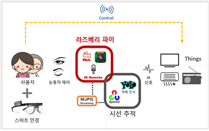
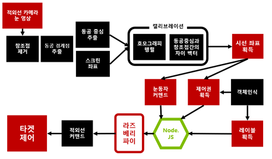

## ■ 적용기술

### ① 하드웨어
#### (1) 스마트안경
- 하드웨어는 외관적인 부분과 원하는 곳에 필요한 장비를 직접 부착하기 위해 직접 사이즈를 디자인하여 3D프린팅을 이용 사람이 착용하는 장비에 핵심은 소형화이기 때문에 필수 장비(웹캠, 적외선 송신기, 라즈베리파이 Zero)들에 대해 시중에서 보편적으로 구할 수 있는 비교제품군 중 최대한으로 소형을 택하였다.

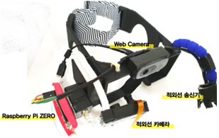

#### (2) 라즈베리파이 + 적외선캠
- 안경에는 라즈베리파이, 웹캠, 적외선 캠, 적외선 송신기, 소형 HDMI 어댑터 1종이 달린다. 

- 하드웨어의 적외선 캠은 기존 라즈베리파이 카메라(적외선과 가시광선 모두 흡수)에서 가시광선 필터를 끼워서 적외선만 인식하는 적외선 카메라로 이용하였다.

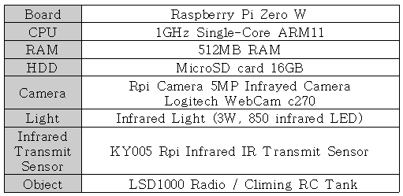

### ② 서버 / 데이터 전송
- 스마트안경에 부착된 라즈베리파이는 MJPG Streaming을 통해 메인 PC로 영상을 전송 메인 서버PC는 스레드를 이용하여 다중 스트리밍을 받는다.
- 메인 PC에서는 MMF(Memory Mapped File) 공유메모리 시스템을 이용하여 동일 PC내에서의 이질적인 개발도구 환경에서도 변수를 공유하였다.
- 사물인식 후 사물을 제어하는 부분에서 신호를 보낼때는 Node JS 서버를 이용한 LIRC(Linux Infrayed Remote Control)를 이용하여 명령을 송신하고, 사물에서 수신한다.
- 현재는 스마트안경 1대에서 스트리밍으로 받아오는 두 개의 영상을 서버 메인 PC 1대에서 처리하는 1대1방식으로 진행하였다.
- 이후에 다수의 스마트안경에 대한 1대 다, 다 대 다 환경이 구성되려면 클라우드, 분산컴퓨팅 등을 이용하여 해결 할 수 있다.

### ③ 시선추적 & 객체인식 & 사물제어
#### (1) 시선추적 (OpenCV)
- 시선추적 알고리즘은 StarBurst 알고리즘(1) 논문에서 제시하는 방향을 참조하였다. 
- 논문에서 제시하는 방향 외에 보정절차를 좀더 강화하여 개인별 눈 위치, 장소에 구애 받지 않고 사용가능 하도록 하였다.
- 각막에 비친 적외선 램프로부터 나오는 각막반사점을 위치를 찾고 제거한다. 이는 거의 고정된 좌표로 이후 캘리브레이션 과정에서 동공 움직임에 대한 고정된 기준점으로 작용한다.
- 동공과 홍채의 명암 차이를 이용하여 동공은 타원이라는 가정하에 타원 모양의 동공 경계점 집합을 찾는다.
- 샘플링을 통하여 원본 모델을 복원하는 RANSAC 알고리즘을 경계점 집합에 적용하여 동공 중심점을 획득한다.
- 동공 좌표와 스크린의 좌표를 맵핑하는 Homography 행렬을 구하는 캘리브레이션 과정을 실행한다.

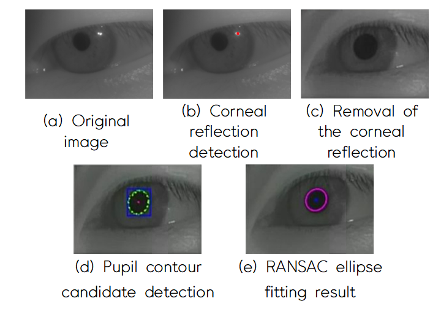

#### (2) 개인별 보정 (1차, 2차)
#### □ 1차 보정절차
- 1차 보정절차에서는 동공에 대한 경계점을 찾기 위해 시작점을 기준으로 360픽셀씩 비교해 나가는데, 그 시작점을 잘 찾기 위한 방법이다.
- 이는 들어오는 영상에 대해서 ‘동공은 동공 주위의 이미지 중에서 가장 어두운 부분’이다라는 점에서 착안하여, 임계값을 낮게 주어 얻은 이진화 영상에 대해 Contour Point를 찾고 그 Contour Point에서의 중심점을 시작으로 한다. 이렇게 되면 좀더 동공추출이 정확해진다.

#### □ 2차 보정절차
- 2차 보정절차에서는 사람마다 안경을 착용했을 때의 눈위치와 정면 좌표에 대한 보정으로, 9개의 점을 순서대로 바라보며 그 점에서의 차이벡터(동공중심점과 각막반사점의 차)와 정면 스크린 좌표에 대한 총 9쌍을 획득하여 그에 대한 호모그래피 행렬을 구하게 된다.
- 사람이 착용시 이 절차를 거치게 되면 사용자의 눈 위치에 적합되어 지는 호모그래피 행렬이 만들어지고 시선이 구해진다.

#### (3) 객체인식 (YOLO)
- YOLO V3를 통한 자체 학습을 진행하였고 두 개 의 클래스(장난감, 라디오)에 대한 각각의 사진 100장씩을 학습시켜 Iteration : 33000 / Loss율 : 0.01 이 될 때까지 진행하였다.

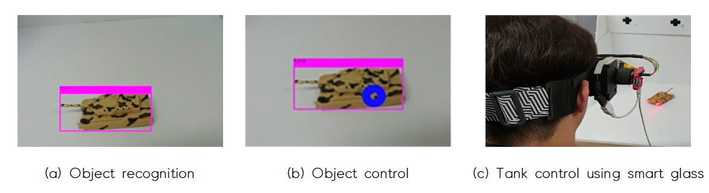

#### (4) 사물제어 (적외선통신)
- 사물을 일정시간(2초)이상 바라보고 있게 되면 사물에 대한 제어권을 얻게 된다.
- 제어권을 얻은 후에는 눈동자 동공중심의 위치에 따라 스마트안경에 달린 적외선 송신기로부터 적외선이 나오게 된다.
- 사물제어는 시연때는 라디오와 장난감 탱크를 이용하여 진행이 가능하며, 다른 제품들 또한 정해진 주파수를 알게되면 제어
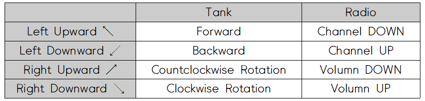

### ■ 각 분야별 사용 플랫폼
- 실시간 스트리밍 : MJPEG Streaming
- 시선추적 : Open CV (3.4.3)
- 객체인식 : YOLO v3
- 사물제어 : Node JS + LIRC(Linux Infrared Remo)

### ■ 참여자
- ⦁ 컴퓨터공학부 박성영 (hs1491012@gmail.com)
- ⦁ 컴퓨터공학부 이강호(1491025@hansung.ac.kr)
- ⦁ 컴퓨터공학부 김재훈(rlawogns08@gmail.com)
- ⦁ 컴퓨터공학부 장성준 seongjuni1@naver.com
- ⦁ 컴퓨터공학부 장두혁(justin214@naver.com) 
- ⦁ 컴퓨터공학부 김선민 (yubi5050@naver.com) 

### ■ 느낀점
- 지나고 나서 생각해보면, 하나의 프로젝트로 캡스톤 디자인, 공학경진대회, 멀티미디어 학회 까지.. 한 프로젝트를 1년여간 시간을 투지하고, 유지보수하고, 점진적으로 더 나아간다는게 정말 쉬운 일은 아니였던 것 같다. 그래도 단계단계 밟아가며 완성할 때마다 정말 느꼇던 만족감과 성취감은 이루 말할 수 없었다. 
- 내가 주로 맡은 Part는 시선 추적 알고리즘 StarBurst를 구현 하는 것으로 해당 관련 논문을 읽고, 여러 다양한 문헌을 읽으며, 열심히 이해하려고 노력했던 것 같다. 
- 처음 캡스톤은 기존 안경에 시선추적을 구현하여 서버로 전송해서 보고 있는 사물에 대한 객체인식을 진행하고 해당 사물에 대한 정보를 App으로 전송해주는 것을 구현하였고, 다음 공학경진대회에서는 해당 안경을 3D 프린터를 이용해 실제작하고, 객체인식(YOLO) 기술로 해당 제품을 인식한 뒤에 적외선 신호를 보내 장비를 동작시키는 기술을 구현하였다.

### ■ 추억팔이
- 캡스톤 사진 (06.07) (왼쪽부터 박성영, 김선민, 김재훈, 이강호) ▼
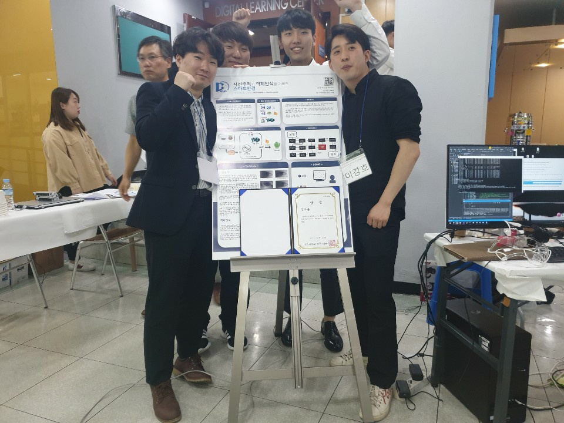

   
   
- 공학경진대회 사진 (09.27) (이강호, 장성준, 장두혁, 김선민, 박성영) ▼
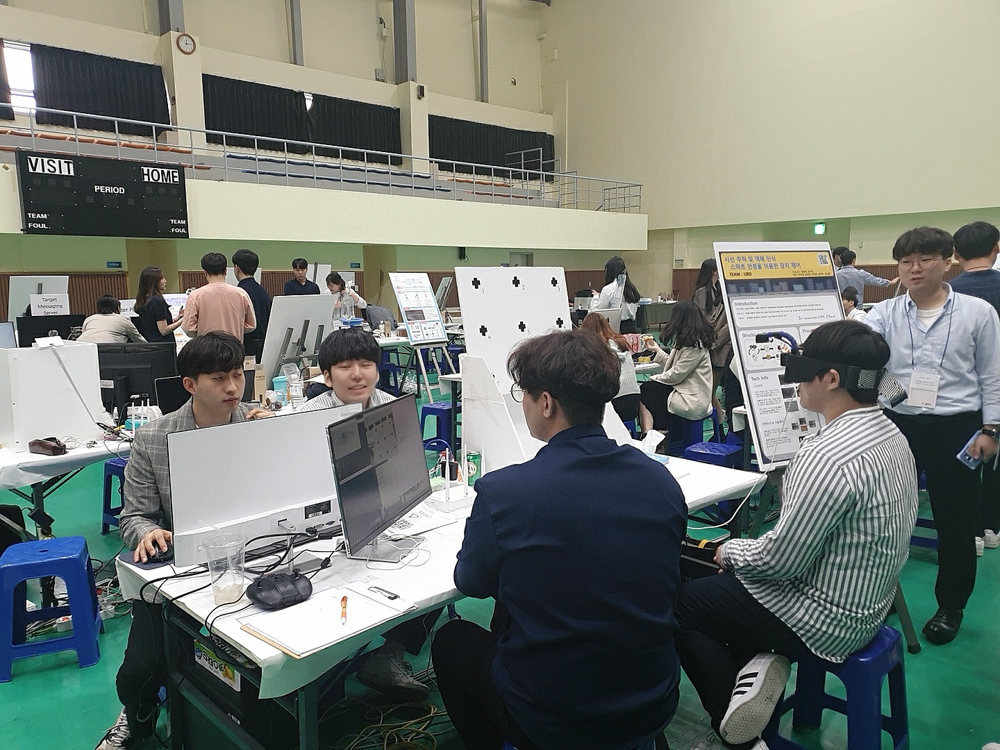

   
   
- 멀티미디어학회 사진 (11.16) (박성영, 장두혁, 엄종석교수님, 김선민, 장성준, 이강호) ▼
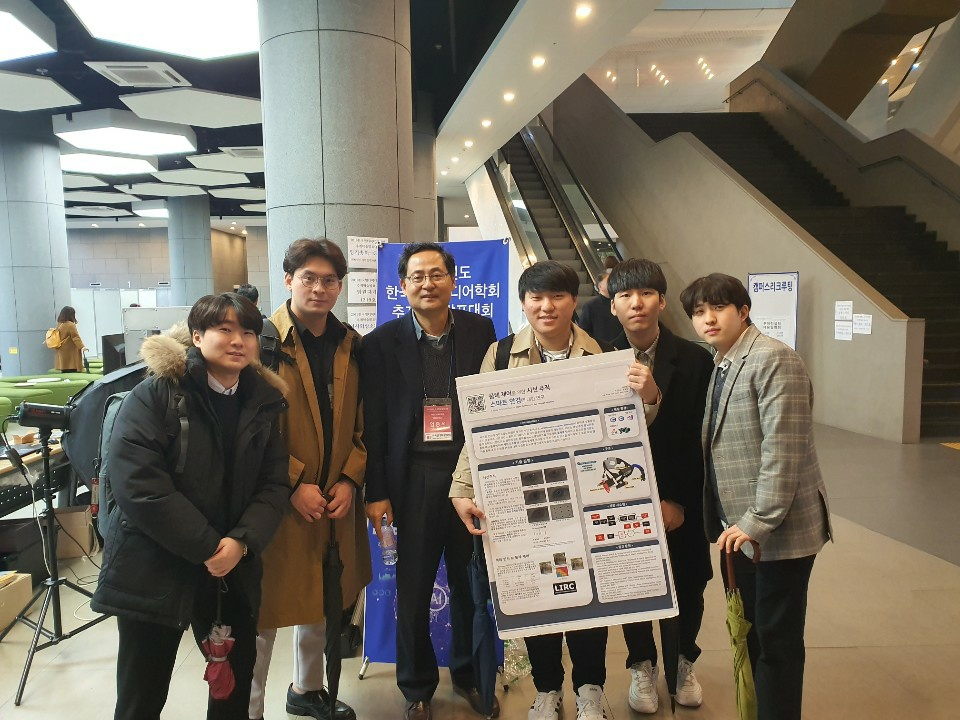
 
   
   
- 스마트글래스 홍보사진 (06.07 - 출연진 : 박성영, 백선진) ▼
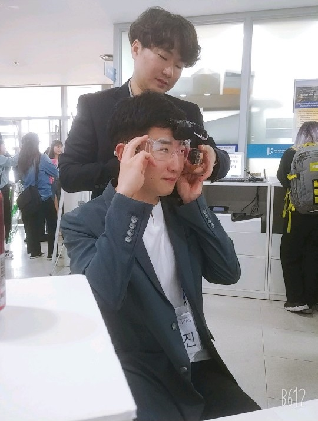

